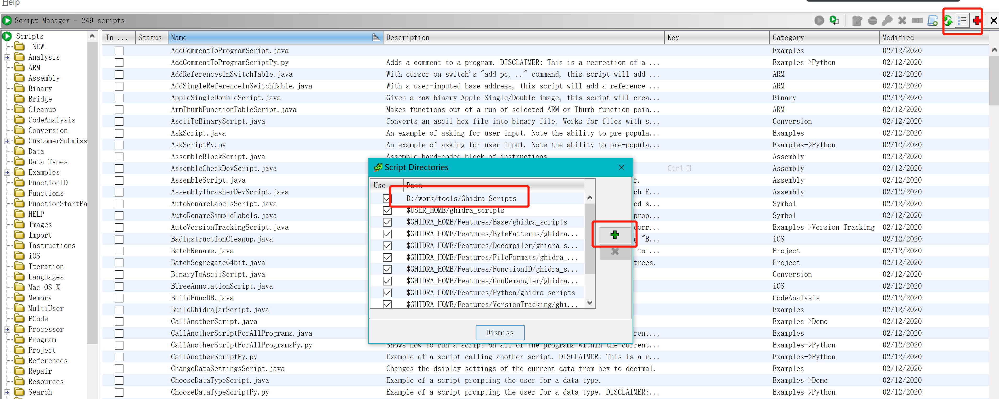
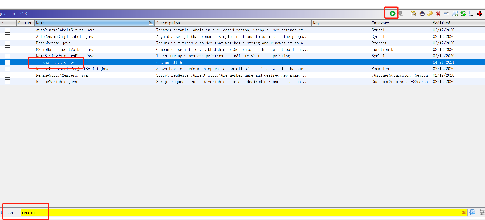
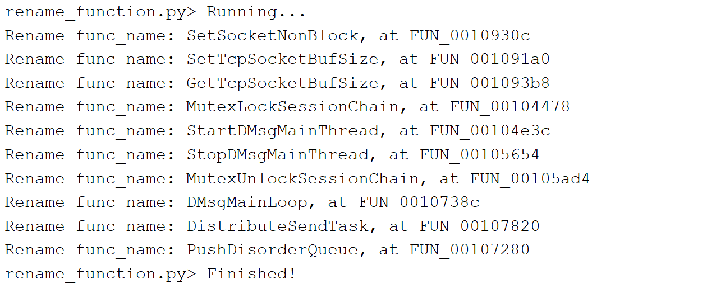
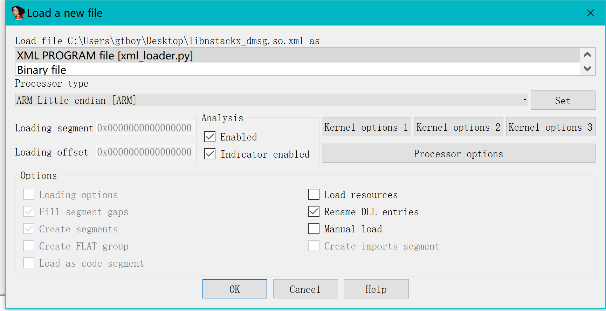

# rename_function
Rename function with Ghidra P-Code.

## Usage
* Change **log_func_addr** with the address of the log print function.
* Change **param_idx** with the param index of the log print function.

Open your Ghidra project, Window->Script Manager, Script Directories (in the toolbar), add the directory of this script :

Search the script in the filter box, and click Run Script button in the toolbar :

Results will be displayed in the console window, and the function name will be modified:

## Convert Ghidra project to IDA project
* Save the Ghidra project firstly.
### Export Ghidra project to xml
In Ghidra: File->Export Program. Select XML format and a directory.
### Import xml into IDA pro
* Open \<ghidra directory\>/Extensions/IDAPro/Python, select IDA version 6xx/7xx, copy the 3 directories into the IDA Pro root dir. These scripts are running on Python2.
  * **idaxml.py** module is a require import or the xml_exporter, xml_importer, and xml_loader. It must be placed in the IDA python folder.
  * **xml_exporter.py** is an IDA loader to build a new database using an XML file. It loads the bytes file and builds the IDA database using the contents of the XML file. It must be placed in the IDA loaders folder.
  * **xml_importer.py** is a plugin to add data from an XML file to an existing database. It will NOT load any binary data from the bytes file. It will add symbols, comments, code, data, functions, etc. for addresses that currently exist in the database. It must be placed in the IDA plugins folder.
  * **xml_loader.py** is an IDA loader to build a new database using an XML file. It loads the bytes file and builds the IDA database using the contents of the XML file. It must be placed in the IDA loaders folder.
* We mainly use xml_loader.py. Start IDA Pro, open the xml file and select processor type:
  